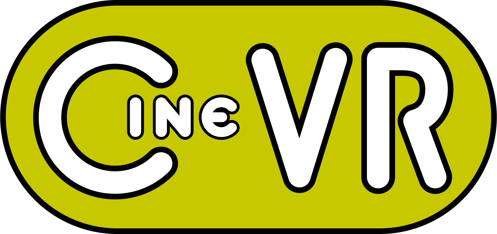

<!--
SPDX-FileCopyrightText: 2025 QuantumHole <QuantumHole@github.com>

SPDX-License-Identifier: GPL-3.0-or-later
-->

# 
Cine-VR displays media in 3D using OpenVR and OpenGL.

It renders a media file into HMD stereoscopically.
It also shows the left eye view in a companion window on the desktop.
It demonstrates handling of a menu structure.
To achieve this, the most basic graphical elements for user interactions had to be implemented from scratch.
These elements contain simple and toggle buttons, slideable gauges as well as scrollable text boxes.
Users can configure some display options via the OpenVR controller.

# Dependencies

## Runtime Dependencies
* [OpenGL](https://www.opengl.org)
* [GLFW](https://www.glfw.org)
* [GLEW](https://www.opengl.org/sdk/libs/GLEW)
* [OpenVR](https://github.com/ValveSoftware/openvr)
* [libpng](https://www.libpng.org/pub/png/libpng.html)
* [libjpeg](https://jpegclub.org/reference/reference-sources)
* [FreeType2](https://freetype.org/index.html)
* [libmpv](https://mpv.io)

## Build Dependencies

* [gcc](https://gcc.gnu.org) or [clang](https://clang.llvm.org)
* [GNU make](https://www.gnu.org/software/make)
* [image magick](https://imagemagick.org)
* [pkg-config](https://www.freedesktop.org/wiki/Software/pkg-config)
* [bc](https://www.gnu.org/software/bc/manual/html_mono/bc.html)

## Lint Dependencies

* [uncrustify](https://github.com/uncrustify/uncrustify)
* [reuse](https://reuse.software)

# Building

`make run`

# Contribution

Before committing, please take care of source code format and proper license information.

`make lint`

# Background Information

Some useful resources for learning the topics covered in this project.
* OpenGL Video tutorials by [Victor Gordan](https://www.youtube.com/@VictorGordan/videos)
